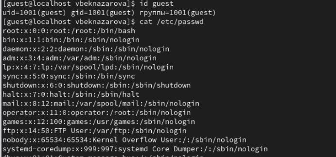
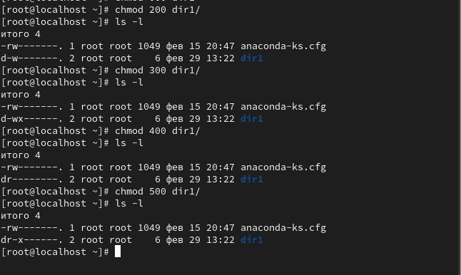
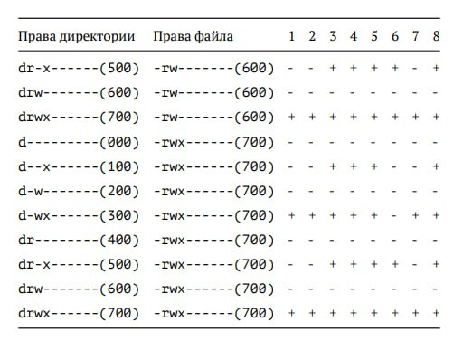

---
## Front matter
lang: ru-RU
title: Лабораторная работа №2
subtitle: Основы информационной безопасности 
author:
  - Бекназарова Виктория Тиграновна
institute:
  - Российский университет дружбы народов, Москва, Россия
date: 29 февраля 2024

## i18n babel
babel-lang: russian
babel-otherlangs: english

## Formatting pdf
toc: false
toc-title: Содержание
slide_level: 2
aspectratio: 169
section-titles: true
theme: metropolis
header-includes:
 - \metroset{progressbar=frametitle,sectionpage=progressbar,numbering=fraction}
 - '\makeatletter'
 - '\beamer@ignorenonframefalse'
 - '\makeatother'
---

## Цели и задачи

Целью данной работы является приобретение практических навыков установки операционной системы на виртуальную машину, настройки минимально необходимых для дальнейшей работы сервисов.

## Актуальность

Научиться работать в консоли. 

## Цели и задачи

Получение практических навыков работы в консоли с атрибутами файлов, закрепление теоретических основ дискреционного разграничения доступа в современных системах с открытым кодом на базе OC Linux. 

## Содержание исследования

1.  В установленной при выполнении предыдущей лабораторной работы операционной системе создаю учётную запись пользователя guest.

{#fig:001 width=95%}

##

2. Задаю пароль для пользователя guest.

{#fig:002 width=95%}

##

3. Входим в систему от имени пользователя guest.

{#fig:003 width=95%}

##

4. Определяем директорию, в которой мы находимся, командой pwd. Также определили, что она является домашней директорией.

{#fig:004 width=95%}

##

5. Уточняем имя пользователя командой whoami.

{#fig:005 width=95%}

##

6. Уточняем имя пользователя, его группу, а также группы, куда входит пользователь, командой id. Сравниваем вывод id с выводом команды groups.

{#fig:006 width=95%}

##

7. Сравниваем полученную информацию об имени пользователя с данными, выводимыми в приглашении командной строки.

##

8. Просматриваем файл /etc/passwd командой cat /etc/passwd. Найдем в нём свою учётную запись. Определим uid пользователя. Определим gid пользователя. Сравним найденные значения с полученными в предыдущих пунктах. Guest имеет те же идентификаторы 1001, наш пользователь под идентификатором 1002. 

{#fig:007 width=95%}

##

{#fig:008 width=95%}

##

9. Определяем существующие в системе директории командой ls -l /home/.

{#fig:009 width=95%}

##

10. Проверяем, какие расширенные атрибуты установлены на поддиректориях, находящихся в директории /home, командой:
lsattr /home. Нам не удалось увидеть расширенные атрибуты директорий других пользователей, только своей домашней директории. 

{#fig:010 width=95%}

##

11. Создаём в домашней директории поддиректорию dir1 командой mkdir dir1. Определяем командами ls -l и lsattr, какие права доступа и расширенные атрибуты были выставлены на директорию dir1.

{#fig:011 width=95%}

##

12. Снимаем с директории dir1 все атрибуты командой сhmod 000 dir1 и проверяем с её помощью правильность выполнения команды ls -l. 

{#fig:012 width=95%}

##

13. Создаем в директории dir1 файл file1 командой echo "test" > /home/guest/dir1/file1. Поскольку ранее мы сняли все атрибуты, то тем самым лишили всех прав на взаимодействие с dir1. 

{#fig:013 width=95%}

##

14. Заполняем таблицу "Установленные права и разрешённые действия", выполняя действия от имени владельца директории (файлов), определив опытным путём, какие операции разрешены, а какие нет. Если операция разрешена, занесите в таблицу знак «+», если не разрешена, знак «-».

Создание файла - 1
Удаление файла - 2
Запись в  файл - 3
Чтение файла - 4
Смена директории - 5
Просмотр файлов в директории - 6
Переименование файла - 7
Смена атрибутов файла - 8 

##

{#fig:014 width=95%}

##

{#fig:015 width=95%}

##

{#fig:016 width=95%}

##

{#fig:017 width=95%}

##

{#fig:018 width=95%}

## Результаты

В ходе выполнения лабораторной работы я получила практические навыки работы в консоли с атрибутами файлов, закрепила теоретические основы дискреционного разграничения доступа в современных системах с открытым кодом на базе OC Linux.

## Итоговый слайд

Я научилась пользоваться консолью. 
