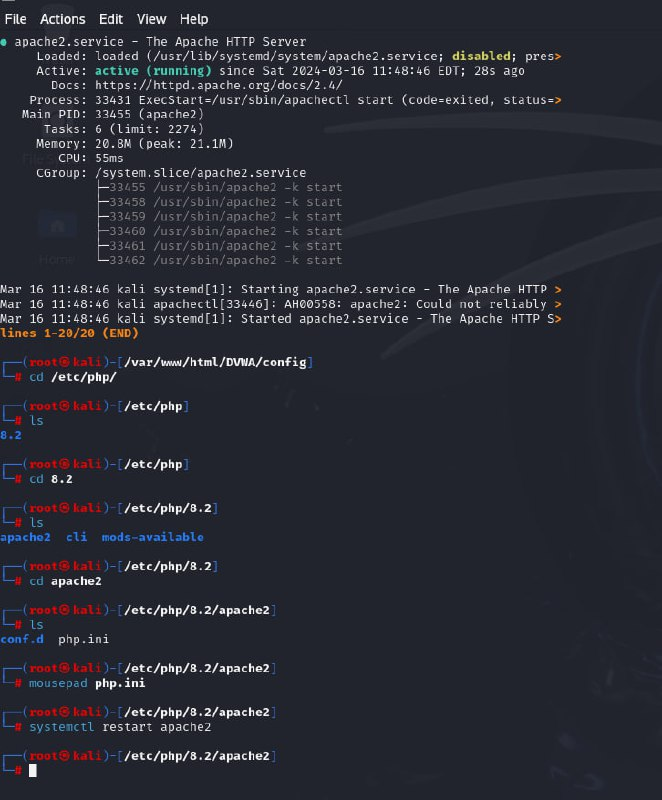
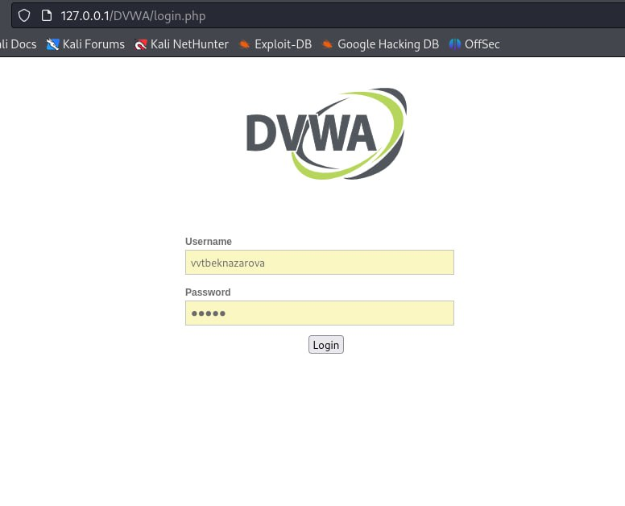

---
## Front matter
lang: ru-RU
title: Индивидуальный проект.
subtitle: 2 Этап
author:
  - Бекназарова Виктория Тиграновна
institute:
  - Российский университет дружбы народов, Москва, Россия
date: 16 марта 2024

## i18n babel
babel-lang: russian
babel-otherlangs: english

## Formatting pdf
toc: false
toc-title: Содержание
slide_level: 2
aspectratio: 169
section-titles: true
theme: metropolis
header-includes:
 - \metroset{progressbar=frametitle,sectionpage=progressbar,numbering=fraction}
 - '\makeatletter'
 - '\beamer@ignorenonframefalse'
 - '\makeatother'
---
# Цель работы

Установить DVWA в гостевую систему Kali Linux.

# Выполнение лабораторной работы

1.Устанавливаю DVWA при помощи различных команд и данного нам репозитория (рис. [-@fig:001]).

{#fig:001 width=95%}

##

2.Заходим на сайт (рис. [-@fig:002]).

{#fig:002 width=95%}

# Выводы

В ходе выполнения данного этапа я установила DVWA в гостевую систему Kali Linux.
